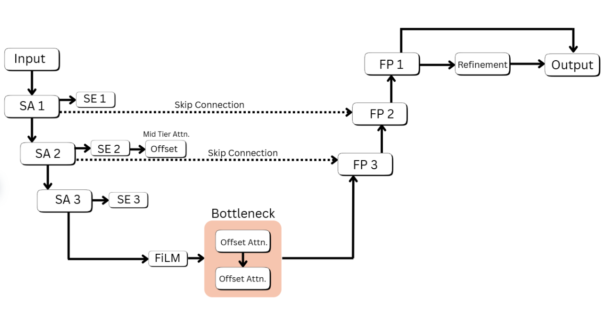

#  Latent-Space Diffusion for 3D Point Cloud Denoising  
### Project Course: CS 299 | Indian Institute of Technology Gandhinagar

<p align="center">
  
</p>

---

##  Project Overview

This project explores **latent-space diffusion for 3D point cloud denoising**, extending the **P2P-Bridge (ECCV 2024)** framework using **transformer-enhanced latent autoencoders**. Instead of performing diffusion directly in raw XYZ coordinate space, we introduce progressively powerful latent autoencoders:

- **AE-1:** Baseline transformer-augmented autoencoder  
- **AE-2:** Skip-connected diffusion-conditioned latent model  
- **AE-3:** Final model with Cross-Attention, SE blocks, and FiLM conditioning  

The result is **stronger global geometry preservation**, improved denoising stability, and significantly reduced **Chamfer Distance** compared to coordinate-space diffusion.

---
<p align="center">
  
</p>
##  Authors


- **Harsh Kumar Jha** — Artificial Intelligence, IIT Gandhinagar  
- **Vishnu Sinha** — Artificial Intelligence, IIT Gandhinagar  

###  Supervised By  
**Prof. Shanmuganathan Raman**  
Jibaben Patel Chair in Artificial Intelligence  
Professor & Head, CSE, IIT Gandhinagar  

---
---

##  Environment Setup & Installation

This project uses a **Conda-based Python environment**.


##  Environment Setup & Installation

To set up the environment for training and evaluation:

```bash
# Activate your conda environment
conda activate p2p_fix

# Navigate into the project directory
cd "point cloud denoising"

# Install all dependencies
pip install -r requirements.txt
```

---

##  Training & Evaluation Pipelines

###  Train the Latent Autoencoder (AE-1 / AE-2 / AE-3)

```bash
python scripts/train_autoencoder.py --config configs/PVDL_PUNET_latent_retrain.yaml
```

---

###  Train the Full Latent-Diffusion Model

```bash
python train.py --config configs/PVDS_PUNet.yaml \
    --name PVDS_PUNet_run \
    --save_dir "/home/seema/point cloud denoising/outputs/"
```

---

###  Evaluate the Trained Model

```bash
python evaluate_objects.py \
    --model_path outputs/PVDS_PUNet_run/step_20000.pth \
    --steps 20 \
    --gpu cuda:0
```

---
##  Qualitative Results

Generated visual results are available in:

- `rendered_pcl/`
- `outputs/`
- `outputs_latent/`
- `eval_output/`

Objects tested include: Camel, Chair, Cow


<p align="center">
  
  
  
</p>

##  Core Features

 **Latent-conditioned diffusion wrapper**  
Adds latent geometry context to the P2P-Bridge diffusion model.

 **Transformer-enhanced autoencoders**  
Multi-scale geometry encoding with PointNet++ + Offset Attention.

 **Cross-Attention fusion**  
Improves alignment between latent features and diffusion inputs.

 **FiLM timestep modulation**  
Learns scale/shift parameters for time-aware latent conditioning.

 **SE channel reweighting**  
Adaptive channel weighting for curvature-sensitive latent features.

 **CUDA-safe Chamfer & P2F metrics**  
Robust evaluation kernels validated for large batches.

 **Modular YAML-based configuration**  
Experiment easily with architectures, hyperparameters, and datasets.


---

##  Future Work

- **Surface-aware normal consistency loss**  
  Improve local fidelity using per-point normal alignment.

- **Curvature-based refinement**  
  Preserve high-curvature structures during reconstruction.

- **kNN-based transformer local refinement**  
  Patch-level transformer modules for manifold-quality corrections.

- **Normal-guided manifold projection**  
  Use predicted normals to refine points onto the true surface.

- **Full DINOv2 semantic integration**  
  Inject semantic priors using 2D vision features lifted into 3D.

